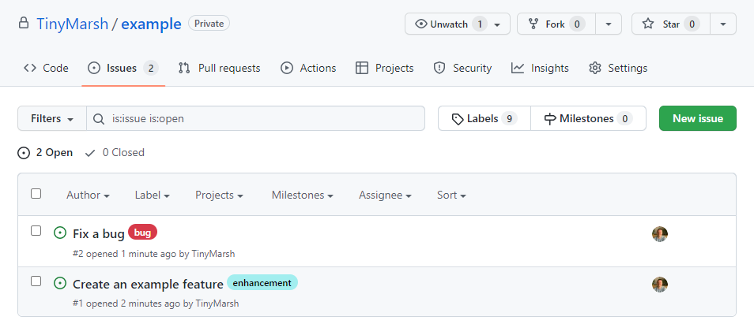
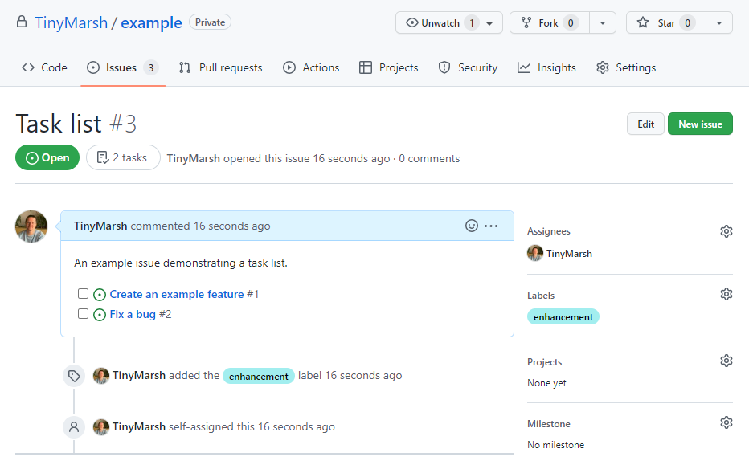
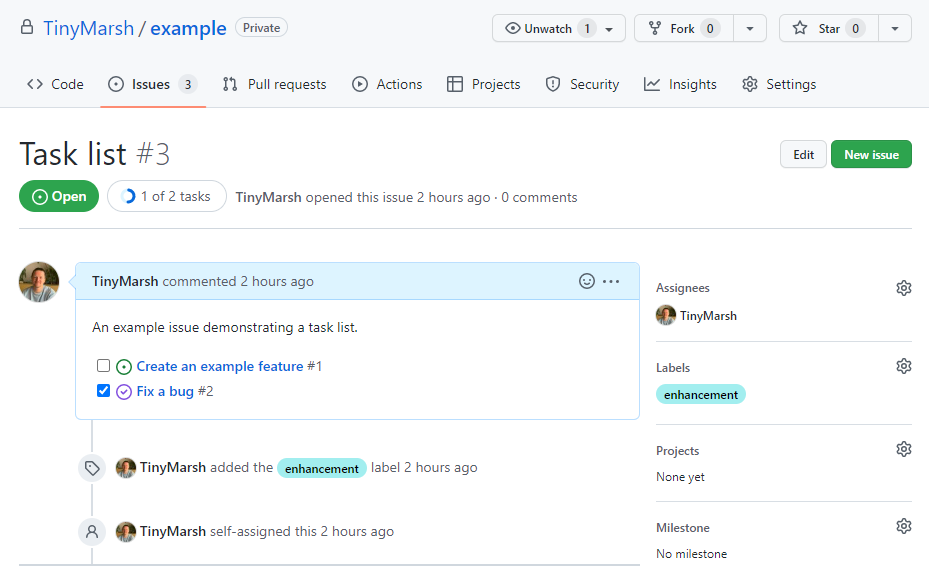

## GitHub issues

- GitHub issues are a feature of GitHub. They let you keep track of your work on a GitHub repository and are used to report bugs, request features or enhancements, or to discuss implementation details of some parts of the code.
 - Issues are a kind of TODO list, with pending and completed tasks as well as serving to prioritise the development activity.
 - Labels can be added to the issues by the repository administrator to inform at a first glance what the issue is about. Typical labels are “bug”, “enhancement”, “low priority” or “good first issue”, for example.
 - Issues also can have one or more people assigned to them who will take care of sorting them out and closing them when done or if no longer relevant.
 - By default any GitHub user can create an issue in a public repository

The following figure shows some of the issues open in a certain repository. The labels tell us there are a couple of bug reports, a couple of issues related to the performance of the software and several ones that are simple enough to be tackled by novice people. Most of them have some discussion going on.

 {:class="img -responsive"}

## Creating GitHub issues
It is possible to create issues in a number of ways (see the GitHub docs page on [creating issues][github-creating-issues] to learn about the various methods). One of the most common and simplest methods is to create an issue from a repository. This can be done by navigating to the main page of the repository on GitHub and click on `Issues`, then click on the `New Issue` button.

> ## Create two new issues
> Follow the information above to create two new issues in your example repository. It doesn't matter what the issue title or contents are at this stage while we are learning how to create issues, but generally this is an important, and you should always refer to a repository's contributing guidelines for how to construct your issue. For now some simple example titles such as "Fix bug" and "Create Feature" will suffice. Try adding some labels to your issues and assigning yourself.
>> ## Solution
>> You have created two new issues and your issues page should look something like this:
>> 
>> Notice the labels have been added next to the issue title, and the assignees' profile pictures are visible too.
> {: .solution}
{: .challenge}

[github-creating-issues]: https://docs.github.com/en/issues/tracking-your-work-with-issues/creating-an-issue

> ## Mentioning other issues
> All issues receive a tag number starting at 1 and preceded by #, 
> like #40 or #110. If you want to refer to an issue in any comment
> anywhere in GitHub, just use its tag number and these will be automatically
> linked from the comment.
{: .callout}

## Keeping track of your work with task lists
GitHub provides functionality with issues which allow you to easily organise and keep track of the work going on in a project and to stay up to date with developments.

A particularly useful way of organising issues is by tracking them as part of a larger issue by using task lists. Tasks lists are a set of tasks which are rendered on GitHub as each being on a separate line with a clickable checkbox. Task lists can be added in any comment on GitHub using Markdown, but, if a task list is added to the body of an issue, extra functionality is provided and can be a powerful way to track progress of segments of work in a project. [Read more about using task lists in the GitHub Docs][github-task-lists].

> ## Create a task list
> Try creating a new issue which contains a task list. To create a task list in the body of an issue, preface list items with hyphen and space followed by `[ ]`. To mark a task as complete, use `[x]`. Create two items in your task list, one for each of the the issues you created earlier. Try referencing the two previously created issues by using a hash followed by the number of the issue e.g. `#2`. (GitHub may prompt you to select an issue as soon as you type a hash)
>> ## Solution
>> You should now have a third issue which contains a task list which references the two issues you created earlier.
>> 
> {: .solution}
{: .challenge}

[github-task-lists]: https://docs.github.com/en/get-started/writing-on-github/working-with-advanced-formatting/about-task-lists

> ### Good-to-know task list functionality
> - If a task references another issue and someone closes that issue, the task's checkbox will automatically be marked as complete.
> - If a task requires further tracking or discussion, you can convert the task to an issue by hovering over the task and clicking the circle icon in the upper-right corner of the task.
> - Any issues referenced in the task list will specify that they are tracked in the referencing issue.

> ## Claim issues
> There are some [restrictions][] on who can be assigned to an issue. If you do
> not have write access to the repository (which is often the case) and you are
> not part of the same organisation of the repository, the only way of being
> assigned to an Issue is by making a comment on the Issue. This also serves to
> warn others that you are volunteering to work on that. A "Hey, I can tackle
> this." is often enough.
{: .callout}

[restrictions]: https://help.github.com/en/github/managing-your-work-on-github/assigning-issues-and-pull-requests-to-other-github-users
> ## Closing issues
> Let's see what happens when you close one of the first two issues you created earlier.
> Open one of the issues you created earlier. Let's say you have addressed the content of the issue and are satisfied that it can now be considered dealt with. Find and click the `Close issue` button at the bottom of the issue. Now return to your task list issue and see if you can spot what is different.
>> ## Solution
>> In your task list issue you should find that one of the referenced issues now has a tick next to it, indicating that it is closed.
>> 
> {: .solution}
{: .challenge}

## Communication is key
Opening issues and tagging them appropriately - such as as a question, bug, feature request, for example - is a much more useful and productive way of contributing to a repository than, say, sending the developer an email. Not only does it make use of the functionality of GitHub and the productivity benefits that entails, but it also means that it is more likely to be found by someone in the future who has a similar query.

> ### Templates
> As a repository maintainer, there are ways you can you can encourage and help contributors to make meaningful issues. One way is to make use of templates. Templates provide a means to standardise the way in which information is povided in an issue. When a contributor wishes to create an issue on your repository, they can then select the appropriate template for their issue which provides them with guidance about what information should be present and how it should be presented. [Read more about using templates to encourage useful issues in the GitHub Docs.][github-templates]

[github-templates]: https://docs.github.com/en/communities/using-templates-to-encourage-useful-issues-and-pull-requests/about-issue-and-pull-request-templates

> ### Mentions
> @mention-ing collaborators can be a convenient way to draw their attention to a comment. Anyone you @ must first have access to your respository. Similarly, we saw above how we can use `#` to link related issues in a comment. Combining these simple yet powerful formatting syntaxes can greatly improve communication efficiency - certainly in line with GitHub best practices.

> ### Staying up to date
> You can keep track of recent comments in an issue by subscribing to an issue so that you receive notifications about latest comments and developments in that issue. Notifications and links to issues you're subscribed to can be found on your GitHub dashboard.


